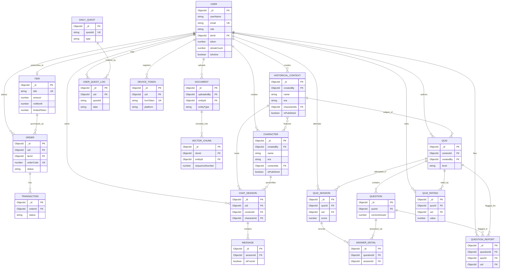

# Database Schema — HistoryTalk

> Rút trực tiếp từ các Mongoose model trong `src/models/*.ts` (ngày 2026-07-28).
> MongoDB không ràng buộc khoá ngoại — mọi quan hệ dưới đây là **quy ước ở tầng
> application** (một field `ObjectId` được resolve bằng `.populate()`), không phải
> constraint của database.

Xem bản vẽ trực quan (ERD + bảng field theo từng domain, có màu) tại artifact đã publish
trong phiên làm việc này. File này là bản text đi kèm, dùng để tra cứu nhanh và commit vào repo.

---

## 1. Tổng quan

19 collection, chia làm 6 domain:

| Domain | Collections |
|---|---|
| Identity & Access | `User`, `Tier` |
| Payments | `Order`, `Transaction` |
| Content & RAG | `HistoricalContext`, `Character`, `DocumentModel`, `VectorChunk` |
| AI Chat | `ChatSession`, `Message` |
| Quiz & Assessment | `Quiz`, `Question`, `QuizSession`, `AnswerDetail`, `QuizRating`, `QuestionReport` |
| Gamification & Engagement | `DailyQuest`, `UserQuestLog`, `DeviceToken` |

**Lưu ý về docs cũ:** `BACKEND_OVERVIEW.md` (mục 8) mô tả `Character`/`HistoricalContext`
có field string tự sinh `characterId` (`char-xxxxxxxxxx`) và `contextId` (`ctx-xxxxxxxxxx`).
Đọc lại model hiện tại thì **hai field này không còn tồn tại** — khoá chính thật sự là
`_id` (ObjectId) của Mongo. Tài liệu này lấy `src/models/*.ts` làm nguồn sự thật, không
lấy theo `BACKEND_OVERVIEW.md`.

---

## 2. Sơ đồ quan hệ (ERD)

*(GitHub và VS Code — với extension Markdown Preview Mermaid Support — render trực tiếp
khối `mermaid` này thành sơ đồ.)*

---

## 3. Chi tiết từng collection

### 3.1 Identity & Access

#### `User` (users)
Tài khoản người dùng: profile, secrets xác thực, số dư token, số liệu gamification.

| Field | Type | Ghi chú |
|---|---|---|
| `_id` | ObjectId | PK |
| `userName` | String | required |
| `email` | String | unique, index |
| `password`, `googleId`, `refreshToken`, `passwordResetToken` | String | `select: false` |
| `fullName`, `dob`, `gender`, `phoneNumber`, `address`, `avatarUrl` | mixed | thông tin profile mở rộng |
| `role` | enum | `CUSTOMER` · `CONTENT_ADMIN` · `SYSTEM_ADMIN` |
| `tierId` | ObjectId FK | → `Tier`, optional |
| `tierExpiresAt` | Date | |
| `token` | Number | số token khả dụng (chat AI, v.v.) |
| `lastActiveDate`, `lastTokenResetAt` | Date | |
| `streakCount`, `longestStreak`, `totalStudyDays`, `lastStudyDate` | mixed | gamification streak học hằng ngày |
| `isActive`, `deletedAt` | Boolean / Date | soft delete |

#### `Tier` (tiers)
Catalog gói subscription — bảng nhỏ, gần như static.

| Field | Type | Ghi chú |
|---|---|---|
| `_id` | ObjectId | PK |
| `title` | enum | `free` · `plus` · `pro`, unique |
| `amount` | Number | giá tiền |
| `noMonth` | Number | số tháng hiệu lực |
| `limitedToken` | Number | số token được cấp |
| `isActive` | Boolean | default true |

### 3.2 Payments

#### `Order` (orders)
Một lần checkout nâng cấp tier.

| Field | Type | Ghi chú |
|---|---|---|
| `_id` | ObjectId | PK |
| `uid` | ObjectId FK | → `User` |
| `tierId` | ObjectId FK | → `Tier` |
| `orderCode` | Number | unique, mã từ payment gateway |
| `checkoutUrl`, `qrCode`, `paymentLinkId` | String | dữ liệu link thanh toán |
| `status` | enum | `pending` · `paid` · `cancelled` · `expired` |
| `paidAt` | Date | |

#### `Transaction` (transactions)
Bản ghi webhook/callback thô từ payment gateway cho một `Order`.

| Field | Type | Ghi chú |
|---|---|---|
| `_id` | ObjectId | PK |
| `orderId` | ObjectId FK | → `Order` |
| `amount` | Number | |
| `payload` | Mixed | payload thô từ gateway |
| `status` | enum | `pending` · `success` · `failed` |

### 3.3 Content & RAG

#### `HistoricalContext` (historicalcontexts)
Một bối cảnh/sự kiện lịch sử — hub mà chat, quiz và nhân vật gắn vào.

| Field | Type | Ghi chú |
|---|---|---|
| `_id` | ObjectId | PK |
| `createdBy` | ObjectId FK | → `User` |
| `name` | String | text index |
| `era` | enum | `ANCIENT`·`MEDIEVAL`·`MODERN`·`CONTEMPORARY`, index |
| `category` | enum | `WAR`·`POLITICS`·`CULTURE`·`SCIENCE`·`RELIGION`·`OTHER` |
| `year`, `startYear`, `endYear`, `isBC` | Number / Boolean | |
| `characterIds[]` | ObjectId[] FK | ↔ `Character`, many-to-many hai chiều |
| `isPublished`, `isActive`, `deletedAt` | mixed | publish + soft delete |

#### `Character` (characters)
Nhân vật lịch sử — persona AI mà user trò chuyện cùng.

| Field | Type | Ghi chú |
|---|---|---|
| `_id` | ObjectId | PK |
| `createdBy` | ObjectId FK | → `User` |
| `name`, `title`, `background`, `personality` | String | `name` text index |
| `bornYear/Month/Day`, `isBornBc`, `deathYear/Month/Day`, `isDeathBc` | Number / Boolean | |
| `era` | enum | |
| `contextIds[]` | ObjectId[] FK | ↔ `HistoricalContext` |
| `isPublished`, `isActive`, `deletedAt` | mixed | |

#### `DocumentModel` (documents)
Văn bản nguồn được upload cho một context/character, phục vụ pipeline RAG.

| Field | Type | Ghi chú |
|---|---|---|
| `_id` | ObjectId | PK |
| `uploadedBy` | ObjectId FK | → `User` |
| `entityId` | ObjectId FK | → `Character` **hoặc** `HistoricalContext` — **polymorphic** |
| `entityType` | enum | `CONTEXT` · `CHARACTER` — phân biệt `entityId` trỏ vào đâu |
| `title`, `fileUrl`, `content` | String | |
| `isActive`, `deletedAt` | mixed | |

#### `VectorChunk` (vectorchunks)
Một chunk embedding của `DocumentModel`, dùng cho Atlas Vector Search.

| Field | Type | Ghi chú |
|---|---|---|
| `_id` | ObjectId | PK |
| `docId` | ObjectId FK | → `DocumentModel` |
| `entityId` | ObjectId FK | polymorphic, denormalize lại từ `Document` |
| `content` | String | text của chunk |
| `embedding` | Number[] | vector; index Atlas Vector Search tạo riêng ngoài Mongoose |
| `sequenceNumber` | Number | thứ tự chunk trong document |

### 3.4 AI Chat

#### `ChatSession` (chatsessions)
Một luồng hội thoại. **Route hiện tại trả 501 (chưa implement controller/service).**

| Field | Type | Ghi chú |
|---|---|---|
| `_id` | ObjectId | PK |
| `uid` | ObjectId FK | → `User` |
| `contextId` | ObjectId FK | → `HistoricalContext` |
| `characterId` | ObjectId FK | → `Character` |
| `title`, `lastMessageAt` | String / Date | |
| `isActive`, `deletedAt` | mixed | |

#### `Message` (messages)
Một lượt trong `ChatSession`, từ user hoặc AI.

| Field | Type | Ghi chú |
|---|---|---|
| `_id` | ObjectId | PK |
| `sessionId` | ObjectId FK | → `ChatSession` |
| `isFromAi` | Boolean | |
| `content` | String | |
| `suggestedQuestions[]`, `quotes[]` | String[] | gợi ý câu hỏi tiếp theo / trích dẫn RAG |
| `token` | Number | số token tiêu tốn để sinh message |

### 3.5 Quiz & Assessment

#### `Quiz` (quizzes)
Bài quiz gắn với một `HistoricalContext`. **Route hiện tại trả 501.**

| Field | Type | Ghi chú |
|---|---|---|
| `_id` | ObjectId | PK |
| `contextId` | ObjectId FK | → `HistoricalContext` |
| `createdBy` | ObjectId FK | → `User` |
| `title`, `description` | String | |
| `level` | enum | `EASY`·`MEDIUM`·`HARD` |
| `grade`, `chapterNumber`, `chapterTitle` | mixed | gắn với chương trình học |
| `playCount`, `rating`, `ratingCount` | Number | denormalize từ `QuizSession`/`QuizRating` |
| `isPublished`, `isActive`, `deletedAt` | mixed | |

#### `Question` (questions)
Một câu hỏi trắc nghiệm thuộc `Quiz`.

| Field | Type | Ghi chú |
|---|---|---|
| `_id` | ObjectId | PK |
| `quizId` | ObjectId FK | → `Quiz` |
| `content`, `options[]` | String / String[] | |
| `correctAnswer` | Number | index vào `options[]` |
| `orderIndex`, `explanation` | Number / String | |

#### `QuizSession` (quizsessions)
Một lần user làm bài `Quiz`.

| Field | Type | Ghi chú |
|---|---|---|
| `_id` | ObjectId | PK |
| `quizId` | ObjectId FK | → `Quiz` |
| `uid` | ObjectId FK | → `User` |
| `limitedTime`, `startTime`, `endTime` | Number / Date | |
| `score`, `totalQuestions`, `percentage` | Number | |

#### `AnswerDetail` (answerdetails)
Chi tiết một câu đã trả lời trong `QuizSession`.

| Field | Type | Ghi chú |
|---|---|---|
| `_id` | ObjectId | PK |
| `questionId` | ObjectId FK | → `Question` |
| `sessionId` | ObjectId FK | → `QuizSession` |
| `selectedOption`, `isCorrect` | Number / Boolean | |

#### `QuizRating` (quizratings)
Đánh giá 1–5 sao của user cho một `Quiz`. Mỗi (user, quiz) chỉ có 1 rating (unique index).

| Field | Type | Ghi chú |
|---|---|---|
| `_id` | ObjectId | PK |
| `quizId` | ObjectId FK | → `Quiz` |
| `uid` | ObjectId FK | → `User` |
| `value` | Number | 1–5, unique theo (`quizId`, `uid`) |

#### `QuestionReport` (questionreports)
User báo cáo một câu hỏi sai/không rõ, để staff duyệt.

| Field | Type | Ghi chú |
|---|---|---|
| `_id` | ObjectId | PK |
| `questionId` | ObjectId FK | → `Question` |
| `quizId` | ObjectId FK | → `Quiz` |
| `uid` | ObjectId FK | → `User` |
| `reason`, `status` | String / enum | `OPEN` · `RESOLVED` |

### 3.6 Gamification & Engagement

#### `DailyQuest` (dailyquests)
Bảng cấu hình nhiệm vụ hằng ngày — admin sửa được, không cần deploy.

| Field | Type | Ghi chú |
|---|---|---|
| `_id` | ObjectId | PK |
| `questId` | String | business key duy nhất, vd `chat_once` |
| `type` | enum | `CHAT` · `QUIZ` · `READ_CONTEXT` |
| `title`, `target`, `rewardTokens`, `order` | mixed | |
| `isActive` | Boolean | |

#### `UserQuestLog` (userquestlogs)
Tiến độ của một user cho một quest, trong một ngày.

| Field | Type | Ghi chú |
|---|---|---|
| `_id` | ObjectId | PK |
| `uid` | ObjectId FK | → `User` |
| `questId` | String | **loose reference** tới `DailyQuest.questId` — không phải ObjectId FK |
| `date` | String | `'YYYY-MM-DD'`, một phần của unique key |
| `progress`, `claimedAt` | Number / Date | unique theo (`uid`, `questId`, `date`) |

#### `DeviceToken` (devicetokens)
Token FCM cho push notification của một thiết bị.

| Field | Type | Ghi chú |
|---|---|---|
| `_id` | ObjectId | PK |
| `uid` | ObjectId FK | → `User` |
| `fcmToken` | String | unique toàn cục — upsert sẽ chuyển token sang user mới khi đổi tài khoản trên cùng máy |
| `platform` | enum | `android` · `ios` |

---

## 4. Quy ước xuyên suốt (cross-cutting conventions)

- **Timestamps:** mọi model đều bật Mongoose `{ timestamps: true }` → tự có `createdAt`/`updatedAt`.
- **Soft delete:** dùng `deletedAt` (+ thường kèm `isActive`) trên các model nội dung/xã hội
  (`User`, `Character`, `HistoricalContext`, `ChatSession`, `Message`, `Quiz`, `DocumentModel`).
  Các bảng lookup/log nhỏ (`Tier`, `Question`, `QuizSession`, `AnswerDetail`, `DailyQuest`,
  `UserQuestLog`, `DeviceToken`, `QuizRating`, `QuestionReport`) không soft-delete.
- **Không có khoá ngoại thật:** tất cả quan hệ là field `ObjectId` (hoặc mảng `ObjectId[]`)
  được `.populate()` ở tầng service — MongoDB không kiểm tra tính toàn vẹn tham chiếu.
- **Hai reference đa hình (polymorphic):** `DocumentModel.entityId` và `VectorChunk.entityId`
  trỏ vào `Character` **hoặc** `HistoricalContext` tuỳ theo `entityType`.
- **Một quan hệ nhiều-nhiều thật sự:** `HistoricalContext.characterIds[]` ↔
  `Character.contextIds[]`, được đồng bộ hai chiều trong
  `CharacterService.attachToContext` — không có collection join riêng
  (khác với `ContextCharacterMapping` từng có trong ERD gốc).
- **Một "loose reference" không dùng ObjectId:** `UserQuestLog.questId` là string, tham
  chiếu logic tới `DailyQuest.questId` (cũng là string business key), không phải
  `Schema.Types.ObjectId` — nên Mongoose không tự populate được, phải tự query.

---

## 5. Nguồn

Sinh ra bằng cách đọc trực tiếp `wdp301-backend/src/models/*.ts` và
`wdp301-backend/src/types/enums.ts` — không dựa vào `BACKEND_OVERVIEW.md` hay
`DATABASE_CHANGELOG.md` vì hai file đó đã lỗi thời so với code hiện tại (thiếu 5
collection: `DailyQuest`, `DeviceToken`, `QuestionReport`, `QuizRating`,
`UserQuestLog`, và mô tả sai field `characterId`/`contextId` của `Character`/`HistoricalContext`).
